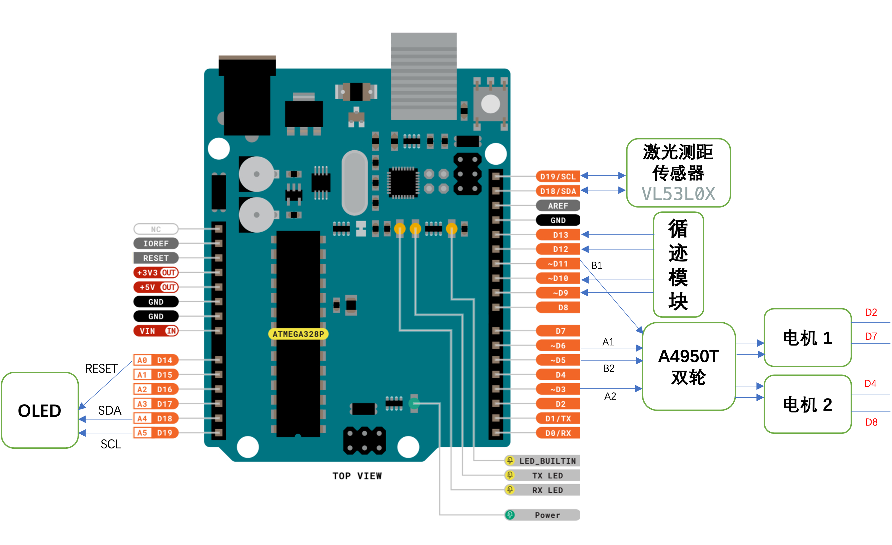
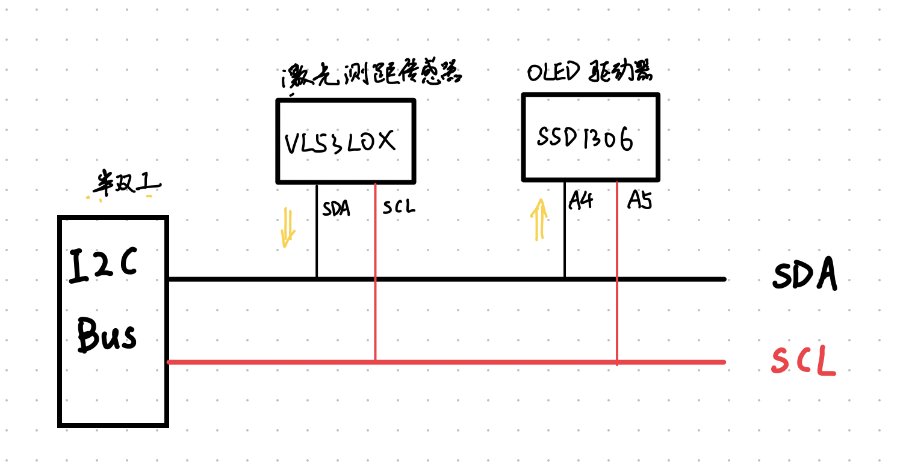

# SDM273-Track-Following-Robot

## Introduction

Track following robot for SDM273 (Intelligent Sensors and Signal Processing) course at SUSTech.

### Hardware
#### Hardware Architecture

Attention: Normally two VL53L0X have the same I2C address. If you want use both, you need to change the address of one of them. Please refer to this [documentation](https://learn.adafruit.com/adafruit-vl53l0x-micro-lidar-distance-sensor-breakout/arduino-code) for more information.

#### I2C Bus

### Software
Install the following libraries in Arduino IDE
- VL53L0X (by Pololu)
- MsTimer2 (by Javier)
- PinChangeInterrupt (by NicoHood)
- Adafruit SSD1306 (by Adafruit)

#### Software Architecture
- `Sensor` class: base class for all sensors
  - `DistanceSensor` class: read the distance from the laser sensor
  - `LineTracking` class: read the track following sensor
- `OLED` class: control the OLED screen
- `MotorControl` class: control the chassis of the robot, singleton pattern
- `leastsquare`: python script to calculate the coefficients

## Usage
Open trackFollowing.ino and upload it to your Arduino board.

## Development Plan
- [x] Drive two motors
- [x] Read the track following sensor
- [x] Implement a feedback control to follow the track
- [x] Stop at a horizontal line
- [x] Use a laser sensor to detect distance to an obstacle
- [x] Show the distance to the obstacle on the OLED screen
- [x] Use filter to process the sensor data, and calculate the result

- [ ] (Optional) After stopping at a horizontal line, calibrate the position of the robot

## Contributors
This project exists thanks to all the people who contribute. 

## License
[GPL-3.0](LICENSE)
